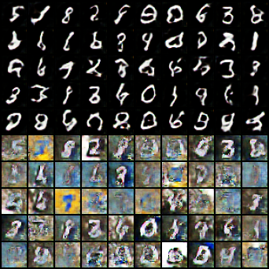
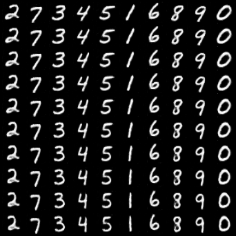
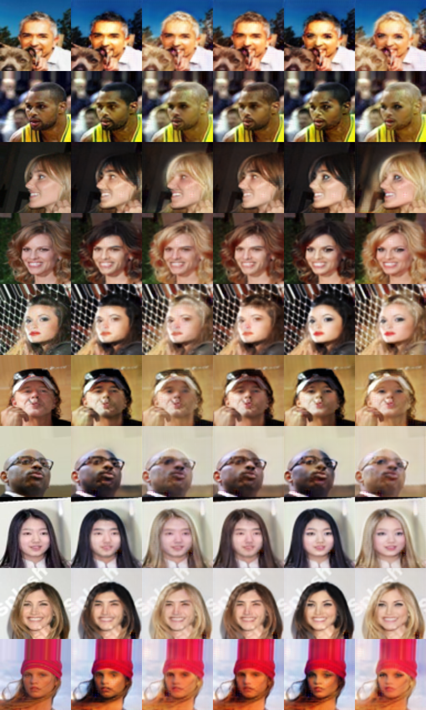

## Pytorch-GAN-mster-2.0
**This repository is for study GAN structure and effects, refer to Pytorch-GAN-mster. I keep the structrure of GAN but uodate code to python3 and fix some bug and the most important thing I added annotations to make them easier to read and customizer to your own datasets. See samples file to observe the effect for each GAN**

## Table of Contents
  * [Installation](#installation)
  * [Demostration](#demostration)
    + [Adversarial Autoencoder](#adversarial-autoencoder)
    + [Auxiliary Classifier GAN](#auxiliary-classifier-gan)   
    + [Boundary-Seeking GAN](#boundary-seeking-gan)   
    + [BEGAN](#began)
    + [BicycleGAN](#bicyclegan)
    + [Context-Conditional GAN](#context-conditional-gan)
    + [Conditional GAN](#conditional-gan)   
    + [Cluster GAN](#cluster-gan)
    + [Coupled GAN](#coupled-gan)
    + [CycleGAN](#cyclegan)      
    + [Deep Convolutional GAN](#deep-convolutional-gan)
    + [DiscoGAN](#discogan)
    + [DRAGAN](#dragan)
    + [DualGAN](#dualgan)   
    + [Energy-Based GAN](#energy-based-gan)
    + [Enhanced Super-Resolution GAN](#enhanced-super-resolution-gan)
    + [InfoGAN](#infogan)
    + [Least Squares GAN](#least-squares-gan)
    + [MUNIT](#munit)
    + [Pix2Pix](#pix2pix)
    + [PixelDA](#pixelda)
    + [Relativistic GAN](#relativistic-gan)
    + [Standard GAN](#standard-gan)
    + [Softmax GAN](#softmax-gan)
    + [StarGAN](#stargan)
    + [UNIT](#unit)
    + [Wasserstein GAN](#wasserstein-gan)
    + [Wasserstein GAN DIV](#wasserstein-gan-div)
## Installation
    $ git clone https://github.com/Chiang1015/PyTorch-GAN-master-2.0
    $ sudo pip3 install -r requirements.txt
    Download datasets to 'Resorces' file
    Run GAN models
## Demostration
## Adversarial Autoencoder

    

## Auxiliary Classifier GAN

    

## Boundary-Seeking GAN

    

## BicycleGAN

    

## Context-Conditional GAN

    

## Conditional GAN

    

## Cluster GAN

    

## Coupled GAN

    

## CycleGAN

    

## Deep Convolutional GAN

    

## DiscoGAN

    

## DRAGAN

    

## DualGAN

    

## Energy-Based GAN

    

## InfoGAN
There are three parameter to control features: c1,c2,z
Each horizontal line use the same parameters but different from one another.
#### changes in c1

    

#### changes in c2

    

#### changes in z

    

## Least Squares GAN

    

## MUNIT

    

## Pix2Pix

    

## PixelDA

    

## Relativistic GAN

    

## Softmax GAN

    

## StarGAN

    

## UNIT

    

## Wasserstein GAN

    

## Wasserstein GAN DIV

    

